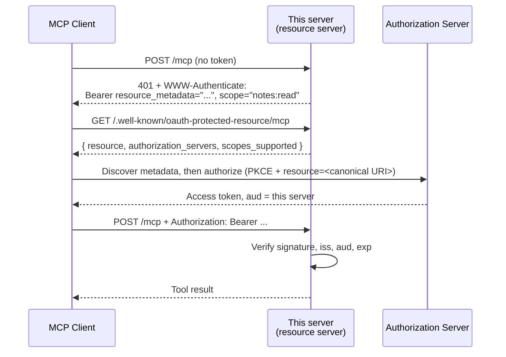

# mcp-oauth-starter

A minimal remote MCP server that actually requires authorization — built against the
**2026-07-28** spec revision, with OAuth 2.1 resource-server semantics wired up and tested.

[](https://github.com/specter-systems/mcp-oauth-starter/actions/workflows/ci.yml)
[](https://www.python.org/)
[](LICENSE)

Most public MCP examples run unauthenticated on `stdio`, which is fine on your laptop and
useless the moment the server is a URL someone else's Claude connects to. This is the other
half: a server that answers `401` with a discovery pointer, validates the token it gets back,
and refuses tokens that were minted for somebody else.

---

## Why this exists

The MCP authorization profile moved on **2026-07-28** (previous revision: 2025-11-25), and
most tutorials still describe the older world. Three changes matter if you are writing a
connector now:

| Change | What it means for your server |
| --- | --- |
| **Stateless core** | The `initialize`/`initialized` handshake and the `Mcp-Session-Id` header are gone. Each request carries its own protocol version and client identity in `_meta`. Your server scales behind a plain round-robin load balancer with no shared session store. |
| **Dynamic Client Registration deprecated** | DCR (RFC 7591) is retained only for backwards compatibility. New work should assume **Client ID Metadata Documents** — the client's `client_id` is an HTTPS URL pointing at its own metadata. That is your authorization server's problem, not this server's, but it should steer which AS you pick. |
| **Issuer validation (RFC 9207)** | Clients must validate the `iss` returned on the authorization response before redeeming the code. Your AS should emit `iss` and advertise `authorization_response_iss_parameter_supported`. |

Verified against `mcp` 2.2.0, where `mcp.types.LATEST_PROTOCOL_VERSION == "2026-07-28"`.

## The one rule you cannot skip

> MCP servers **MUST** validate that access tokens were issued specifically for them as the
> intended audience, according to RFC 8707 Section 2.
> — MCP 2026-07-28, *Token Handling*

A signed, unexpired, entirely legitimate token issued for **another** resource server must be
rejected here. Accept it and your server becomes a replay target: anyone holding a token for
any other service on the same authorization server can drive your tools. That is the
confused-deputy problem, and it is one `audience=` argument away from being a real breach.

This repo enforces it twice — once in [`verifier.py`](src/mcp_oauth_starter/verifier.py) via
`jwt.decode(..., audience=...)`, and again through `validate_token_resource=True` in the
bearer middleware. There is a test for it:
[`test_token_for_another_audience_is_rejected`](tests/test_verifier.py).

## What the SDK leaves to you

`mcp` 2.2.0 publishes the RFC 9728 metadata document and emits a `401` with `error`,
`error_description` and `resource_metadata` — but not the RFC 6750 `scope` parameter, which
the spec says servers **SHOULD** send. Without it a client falls back to `scopes_supported`
from the metadata document, costing an extra round trip on every cold start.

[`challenge.py`](src/mcp_oauth_starter/challenge.py) is a small ASGI wrapper that appends it:

```http
WWW-Authenticate: Bearer error="invalid_token", error_description="Authentication required",
                  resource_metadata="https://mcp.example.com/.well-known/oauth-protected-resource/mcp",
                  scope="notes:read notes:write"
```

## The flow



## Quickstart

```bash
git clone https://github.com/specter-systems/mcp-oauth-starter
cd mcp-oauth-starter
pip install -e ".[dev]"

cp .env.example .env      # then edit it — see the table below
set -a && source .env && set +a
mcp-oauth-starter         # serves on http://127.0.0.1:8000/mcp
```

Confirm the discovery document and the challenge before you connect a client:

```bash
curl -s localhost:8000/.well-known/oauth-protected-resource/mcp | jq
curl -si -X POST localhost:8000/mcp \
  -H 'Accept: application/json, text/event-stream' \
  -d '{"jsonrpc":"2.0","id":1,"method":"tools/list"}' | head -12
```

You should get a `401` whose `WWW-Authenticate` header names the metadata URL. If you get a
`200`, your server is unprotected — stop and fix that before deploying anything.

## Configuration

| Variable | Required | Notes |
| --- | --- | --- |
| `MCP_RESOURCE_URL` | yes | The canonical URI of this server (RFC 8707 §2), exactly as clients send it in `resource`. https, no fragment, **no trailing slash**. A mismatch here is the single most common cause of "my token keeps getting rejected". |
| `MCP_AUTH_ISSUER` | yes | Issuer identifier of your authorization server. Must equal the `iss` claim byte-for-byte. |
| `MCP_JWKS_URL` | yes | Usually `jwks_uri` from `{issuer}/.well-known/oauth-authorization-server`. Keys are cached and refetched on an unknown `kid`, so rotation needs no redeploy. |
| `MCP_REQUIRED_SCOPES` | no | Space-separated. Advertised as `scopes_supported` and in the challenge. Keep it to the minimum for basic functionality and ask for more per tool. |
| `MCP_ALGORITHMS` | no | Defaults to `RS256`. `none` is refused at construction. |
| `HOST` / `PORT` | no | Defaults to `127.0.0.1:8000`. |

## Scopes

`MCP_REQUIRED_SCOPES` gates the whole server. Individual tools can ask for more —
`write_note` calls `require_scope("notes:write")` — which is what you want when one connector
exposes both reads and writes and you would rather not hand every caller write access.

Per the spec, return **all** scopes needed for an operation in a single `403` challenge.
Challenging for one missing scope at a time forces repeated authorization round-trips and
makes the connector feel broken.

## Tests

```bash
pytest -q
```

Covers audience rejection, issuer rejection, expiry, missing `aud`, malformed tokens, the
`scope` / `scp` claim shapes that Okta and Entra disagree about, the RFC 9728 discovery
document, the shape of the `401` challenge, and the `scope` parameter added on top of it.

## What this is not

- **Not an authorization server.** It does not issue tokens. Point it at one you run or buy.
- **Not a production connector.** It is the auth scaffolding with three illustrative tools;
  the business logic is yours.
- **Not opaque-token ready.** It assumes JWTs. For opaque tokens, swap `verify_token` for an
  RFC 7662 introspection call and cache the result.

## License

MIT — see [LICENSE](LICENSE).

---

Built by [Specter Systems](https://specter-systems.github.io) — Claude MCP connectors, Python
data pipelines and outreach automation. Doha, Qatar; working remotely.
